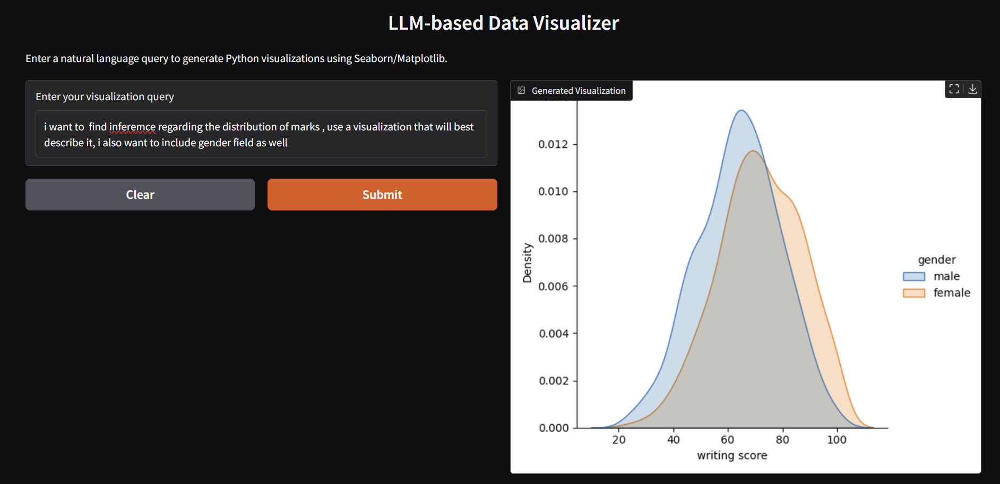
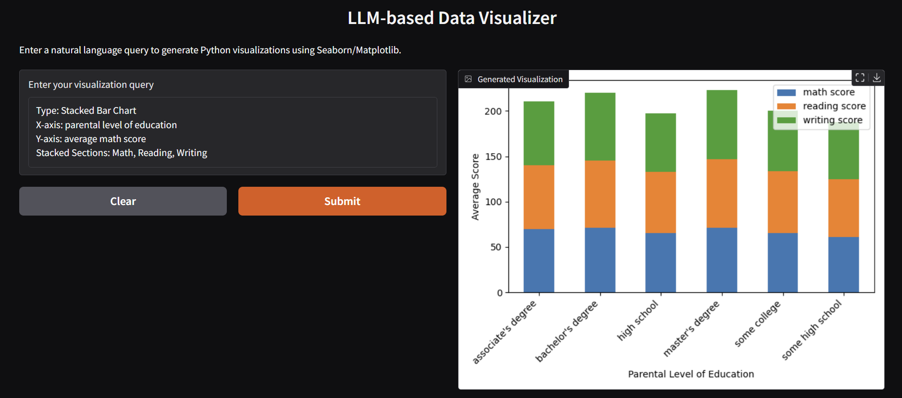

# NL2Viz (Natural Language to Visualization):

This script is an AI-powered data visualization tool that takes natural language queries from a user and generates corresponding Python visualization code using a Hugging Face language model. The system loads a CSV dataset into a pandas DataFrame, constructs a prompt containing sample data and column names, and sends it to the model to generate visualization code using Matplotlib and Seaborn. The generated code is then executed to display the visual output. The process is orchestrated using a state graph built with LangGraph.

Dataset Used for testing: [Students Performance Dataset](https://www.kaggle.com/datasets/whenamancodes/students-performance-in-exams)

## Instructions to run:
1. `git clone https://github.com/NeelShah09/NL2Viz.git`
2. Go to the directory `cd NL2Viz` and create a virtual environment by `python -m venv .venv`
3. `source ./.venv/Scripts/activate`
4. Create a `.env` file with `HUGGINGFACE_TOKEN` set as the huggingface token
5. Then run `python main.py`

## Sample GUI Snapshots

### 1. Prompt: i want to find inferemce regarding the distribution of marks , use a visualization that will best describe it, i also want to include gender field as well

### Output:

### 2. Prompt: 
### &nbsp;&nbsp;&nbsp;&nbsp;&nbsp;&nbsp;&nbsp;&nbsp; Type: Stacked Bar Chart
### &nbsp;&nbsp;&nbsp;&nbsp;&nbsp;&nbsp;&nbsp;&nbsp; X-axis: parental level of education
### &nbsp;&nbsp;&nbsp;&nbsp;&nbsp;&nbsp;&nbsp;&nbsp; Y-axis: average math score
### &nbsp;&nbsp;&nbsp;&nbsp;&nbsp;&nbsp;&nbsp;&nbsp; Stacked Sections: Math, Reading, Writing

### Output:

